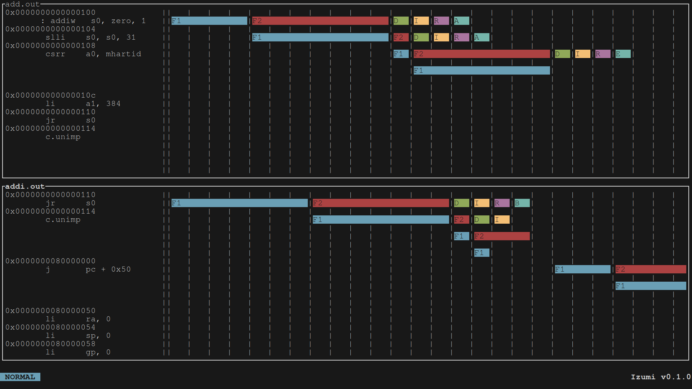

# izumi_tui (aka Izumi)

Izumi is a multi-format instruction pipeline dump TUI visualizer based on [shioyadan/Konata](https://github.com/shioyadan/Konata). Izumi is the reference frontend for [Izumi-visualizer/libizumi](https://github.com/Izumi-visualizer/libizumi), which provides the required parsing capabilities.

> [!Note]
> The tool is still under development and may not work properly with full
> features of the format.

## Supported features

- Instruction

    Only support for file identificator
- Stage
- Line on left
- End of stage (for multiple cycle stages/stalling the pipeline)
- End of instruction

## Requirements

- `ncurses`
- `libizumi` (can be built alongside `izumi_tui`)
- `make` (build only)
- `autotools` (build from source only, not needed in distribution packages)

## Building (and installing)

If you cloned the repository instead of downloading a distribution package,
start by generating the build system:

```sh
autoreconf --install
```

With the `configure` script available, you can follow the traditional mantra:

```sh
mkdir build && cd build       # Any path supported!
../configure
make
(sudo) make install
```

Some intersting `configure` flags:
- `--without-system-libizumi` to build libizumi alongside izumi_tui (libizumi sources must be placed or linked in a `libizumi` directory next to the `configure` script)
- `--enable-sanitizers` to enable ASAN (not recommended if you aren't actively developing Izumi!)
- `--help` to see more options!

### Nix derivation

You can also use `nix` (flakes recommended):
```bash
nix run github:Izumi-visualizer/izumi_tui
```

## Usage

Use the installed `izumi` binary...
```sh
izumi path/to/file
```
... or use the `make` wrapper:
```sh
make run ARGS=path/to/file
```

> [!IMPORTANT]
> If sanitizers are enabled, an `AddressSanitizer:DEADLYSIGNAL` error can be raised randomly when starting the program. Just kill the program and try again. If it persists, please report it.

### Commands

| Command | Description |
|---------|-------------|
| `:q`    | Quit        |
| `:quit` | Quit        |
| `:open (path)`    | Open a file on the current panel |
| `:o (path)`    | Open a file on the current panel |
| `:findpc 0x(address)` | Search and go to the first appearance of the address |
| `:findinst (instruction)` | Search and go to the first appearance of the instruction |
| `:next` | Next appearance of the last search |
| `:prev` | Previous appearance of the last search |
| `:newpanel` | Create a new panel |
| `:panelcmd j` | Select next panel |
| `:panelcmd k` | Select previous panel |
| `:closepanel` | Close focused panel |
| `:c` | Close focused panel |
| `:closepanel (index)` | Close requested panel |
| `:c (index)` | Close requested panel |
| `:closeallpanels` | Close all panels |
| `:ca` | Close all panels |
| `:set bar_offset (amount)` | Set offset of the vertical bar (not persistent) |
| `:set stage_width (amount)` | Set width of the stage on the pipeline visualizer (not persistent) |
| `:set color (element) (foreground color) (background color) <bold>` | Set color of the element (not persistent) |
| `:panelsync` | Sync movement of all the panels |
| `:paneldesync` | Desync movement of all the panels |

> [!NOTE]
> The `:set` commands are not persistent, so you will need to set them again on the next run.

> [!IMPORTANT]
> Information for the `:set color` command
>
> The `<element>` option can be one of the following:
> - `text` Sets the color of the text shown on the screen
> - `commands` Sets the color of the commands shown on the bottom of the screen when typing one
> - `box` Sets the color of the box around the window
> - `status` Sets the color of the status of the application at the bar on the bottom of the screen
> - `error_text` Sets the color of the text shown on errors
> - `timeline` Sets the color of the timelines generated
> - `stage_1` Sets the color of the first stage of the pipeline
> - `stage_2` Sets the color of the second stage of the pipeline
> - `stage_3` Sets the color of the third stage of the pipeline
> - `stage_4` Sets the color of the fourth stage of the pipeline
> - `stage_5` Sets the color of the fifth stage of the pipeline
> - `stage_6` Sets the color of the sixth stage of the pipeline
> If there are more than six stages, the color of the seventh and following stages will return to the color of the first stage and repeat the cycle.
>
> It requires the color to be one of the list:
> - `black`
> - `white`
> - `red`
> - `green`
> - `yellow`
> - `blue`
> - `magenta`
> - `cyan`
>
> The `<bold>` option is optional. If you want to set a color to bold, just add `bold` at the end of the command.

### Keybindings

| Key | Description |
|-----|-------------|
| `n` | Next appearance of the last search |
| `N` | Previous appearance of the last search |
| `j` | Move down |
| `KEY_DOWN` | Move down |
| `k` | Move up |
| `KEY_UP` | Move up |

## Screenshot



I know it's not the best looking tool, but it's a start (now it has colors :D).

---


